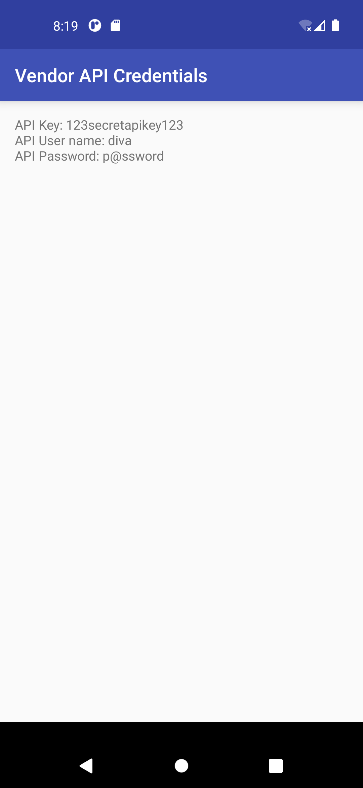
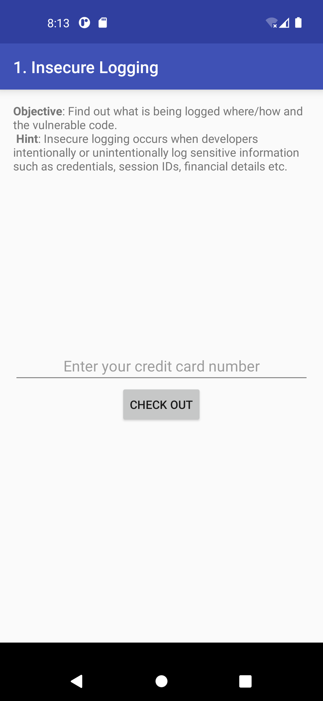

# LAB 7 : Analyse Dynamique Mobile avec MobSF

Ce laboratoire porte sur l'analyse dynamique (runtime) de l'application Android **DIVA (Damn Insecure and Vulnerable App)** en utilisant **MobSF (Mobile Security Framework)**.

## 🎯 Objectifs du lab
- Comprendre en profondeur l’analyse dynamique (runtime) d’une application Android avec MobSF.
- Configurer un émulateur propre sans Play Store.
- Installer/lancer MobSF via Docker.
- Tester l’APK vulnérable DIVA en dynamique : logs runtime, trafic réseau, instrumentation Frida, proxy HTTPS, etc.
- Apprendre à détecter des vulnérabilités en temps réel (stockage insecure, intents, hard-coded secrets, etc.).

---

## 🚀 Étape 1 : Création de l’émulateur AVD sans Play Store
1. Ouvrez **Android Studio** → **Tools** → **AVD Manager** → **Create Virtual Device**.
2. Choisissez un téléphone (ex. : Pixel 5 ou Pixel 6).
3. Dans **System Image** : Sélectionnez Android (ou Google APIs) **SANS "Google Play"**.
4. Choisissez l'API 28 à 30 (recommandé : API 29 ou 30, x86_64).
5. Nommez l’AVD : `MobSF_DIVA_API_30`.

## 📂 Étape 2 : Cloner MobSF pour les scripts AVD
Ouvrez un terminal et tapez :
```bash
git clone https://github.com/MobSF/Mobile-Security-Framework-MobSF.git
cd Mobile-Security-Framework-MobSF
```

## 🛠️ Étape 3 : Lancement de l’émulateur avec le script MobSF
Dans le dossier MobSF :
- **Windows** : `scripts\start_avd.ps1`
Le script liste vos AVD → choisissez `MobSF_DIVA_API_30`.
```bash
./scripts/start_avd.sh MobSF_DIVA_API_30
```
L'émulateur démarre (30-60s). Vérifiez avec `adb devices` pour voir `emulator-5554 device`.

## 🐳 Étape 4 : Installation et lancement de MobSF via Docker
Récupérez l'image :
```bash
docker pull opensecurity/mobile-security-framework-mobsf:latest
```
Lancez MobSF avec l'identifiant de l'émulateur :
```bash
docker run -it --rm \
  -p 8000:8000 \
  -e MOBSF_ANALYZER_IDENTIFIER=emulator-5554 \
  opensecurity/mobile-security-framework-mobsf:latest
```
Accès via navigateur : `http://127.0.0.1:8000` (Login: `mobsf` / Pass: `mobsf`).

---

## 📱 Étape 5 : Préparation de l’APK DIVA
DIVA est une application contenant 13 challenges vulnérables.
- Téléchargez l'APK sur le site officiel ou via GitHub.
- Gardez le fichier `diva.apk` prêt sur votre bureau.

## 🔍 Étape 6 : Analyse Statique + Dynamique de DIVA
1. Dans MobSF → **Upload & Analyze** → choisissez `diva.apk`.
2. Une fois l'analyse statique terminée, cliquez sur **Start Dynamic Analyzer**.

MobSF va configurer automatiquement l'environnement (Frida Server, Proxy HTTPS, installation de l'APK).

### Exploration dans MobSF Dynamic Analyzer :
- **Runtime Logs** : Visualisation des logs en live.
- **Network Traffic** : Interception du trafic HTTP/HTTPS.
- **Frida** : Injection de code et hooking de méthodes.

### Exemples de vulnérabilités trouvées :
| Challenge | Observation |
|-----------|-------------|
| **Insecure Data Storage** | Capture des fichiers écrits en clair dans le stockage local. |
| **Access Control** | Détection d'intents non sécurisés. |
| **Insecure Logging** | Fuite d'informations sensibles dans Logcat. |

---

## 🛠️ Description du Menu Dynamic Analyzer

| Option | Utilité en analyse dynamique |
| :--- | :--- |
| **Stop Screen** | Arrêter le mirroring de l’écran de l’émulateur. |
| **Remove Root CA** | Nettoyer l’environnement après interception HTTPS. |
| **Unset Proxy** | Arrêter la redirection du trafic réseau vers MobSF. |
| **TLS Security** | Vérifier la validation des certificats et faiblesses TLS. |
| **Activity Tester** | Lancer et observer les écrans internes (activités exportées). |
| **Take Screenshot** | Documenter une étape de test ou une vulnérabilité. |
| **Logcat Stream** | Afficher les logs Android en temps réel (détection de fuites). |
| **Generate Report** | Regrouper tous les résultats dans un rapport final. |

---

## 📸 Captures d'écran du Laboratoire

### Interface Globale et Menu



### Tests de Vulnérabilités


## 🏁 Conclusion
Ce lab m'a permis de pratiquer l'analyse en temps réel, d'intercepter du trafic chiffré et d'observer comment une application manipule les données sensibles en mémoire et sur le stockage.

---
*Réalisé par Wissal MOKDAD*
