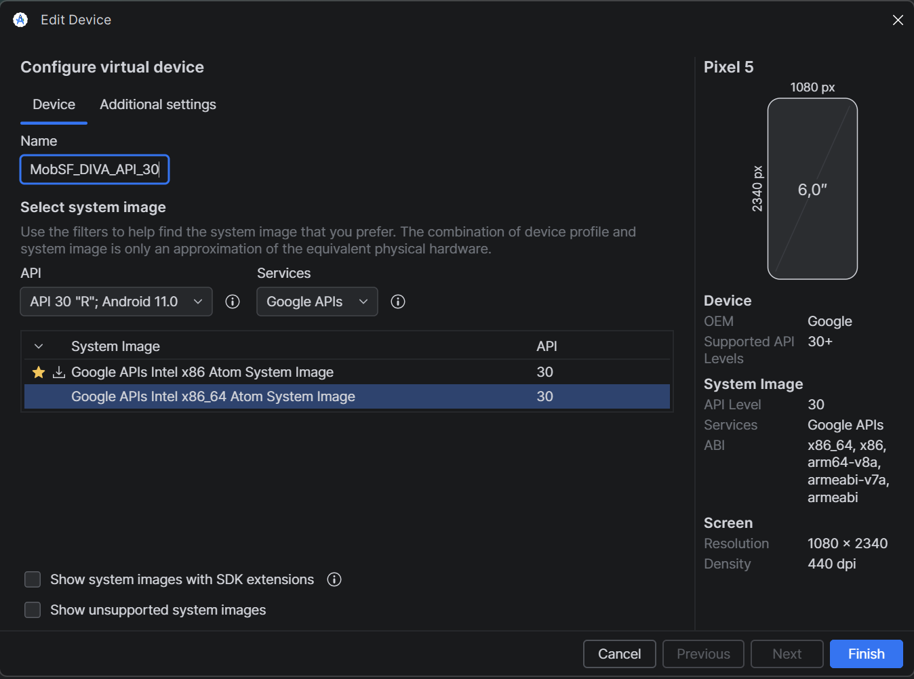
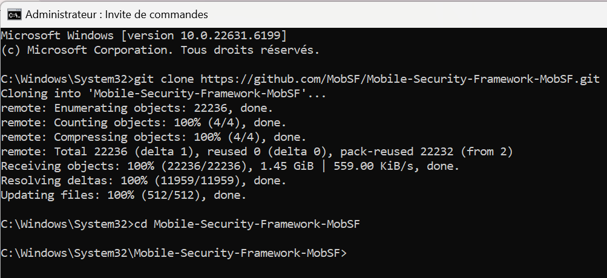
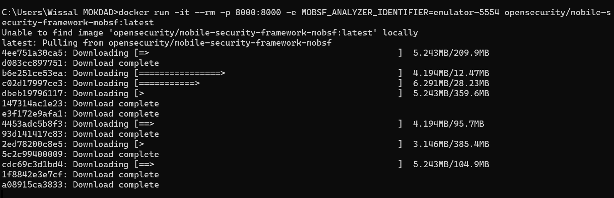
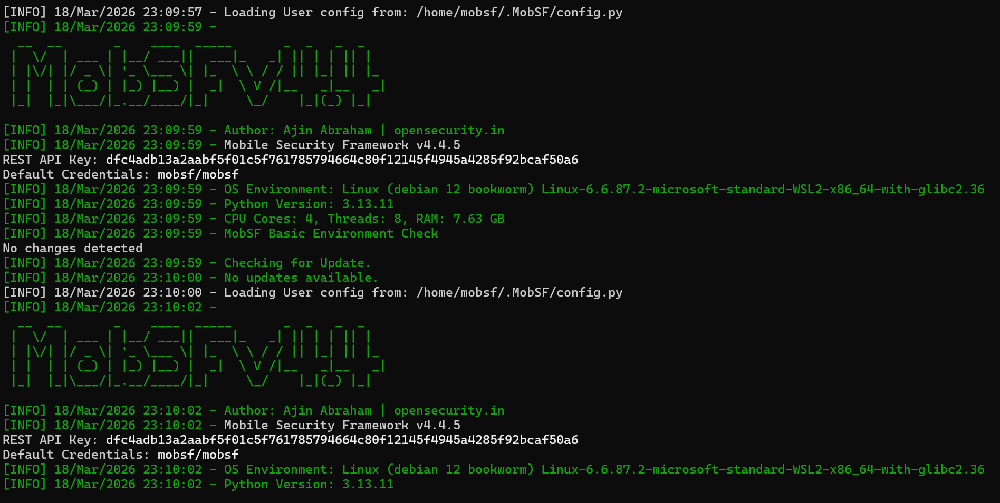
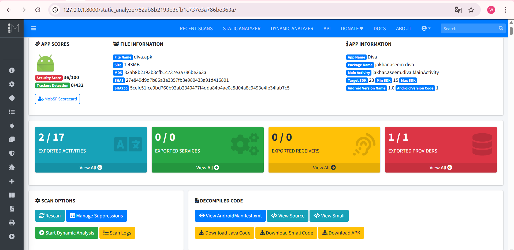
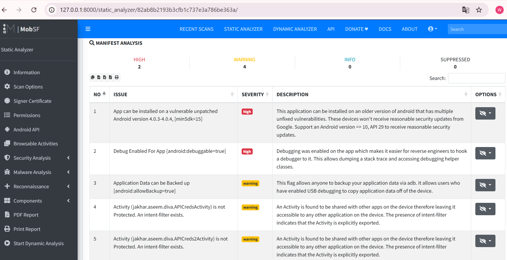
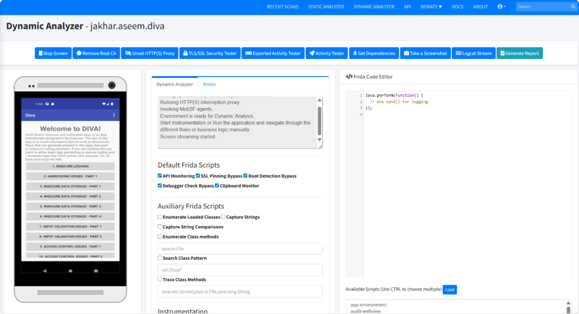

# LAB 7 : Analyse Dynamique Mobile avec MobSF

Compte rendu du Laboratoire 7 portant sur l'analyse dynamique de l'application **DIVA (Damn Insecure and Vulnerable App)** à l'aide de **MobSF (Mobile Security Framework)**.

## Objectifs du TP
- Réaliser une analyse dynamique d’une application mobile Android.
- Exploiter les vulnérabilités courantes (OWASP MASVS).
- Utiliser ADB (Android Debug Bridge) pour interagir avec l'émulateur.
- Analyser les logs et le stockage local pour identifier des fuites de données.

## Environnement de Travail
- **OS de test :** Mobexler VM / Genymotion Cloud.
- **Outils :** MobSF, ADB, DIVA APK.
- **Application :** Diva-beta.apk.

## Étapes Réalisées

### 1. Configuration et Lancement de MobSF
Lancement de l'outil MobSF et préparation de l'environnement d'analyse dynamique.

### 2. Analyse de Insecure Logging
Exploitation de la vulnérabilité liée aux journaux d'activité (Logcat) qui révèlent des informations sensibles saisies par l'utilisateur.

### 3. Insecure Data Storage
Analyse du stockage local de l'application (SharedPreferences, Bases de données SQLite) pour trouver des identifiants stockés en clair.

### 4. Input Validation Issues
Tests sur les composants de l'application pour vérifier la validation des entrées utilisateur.

### 5. Access Control Issues
Tentatives d'accès à des composants protégés ou cachés de l'application via ADB.

## Conclusion
Ce laboratoire a permis de mettre en évidence l'importance de l'analyse dynamique pour détecter des vulnérabilités qui ne sont pas toujours visibles lors d'une analyse statique, notamment les fuites de données en cours d'exécution et les erreurs de configuration des composants Android.

---
*Réalisé par Wissal MOKDAD*
